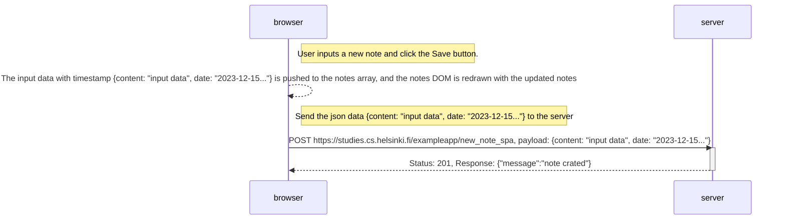

Here is the diagram when user creates a new note at [the spa page](https://studies.cs.helsinki.fi/exampleapp/spa.):

```mermaid
sequenceDiagram
participant browser
participant server

    Note right of browser: User inputs a new note and click the Save button.
    browser-->>browser: The input data with timestamp {content: "input data", date: "2023-12-15..."} is pushed to the notes array, and the notes DOM is redrawn with the updated notes
    Note right of browser: Send the json data {content: "input data", date: "2023-12-15..."} to the server

    browser->>server: POST https://studies.cs.helsinki.fi/exampleapp/new_note_spa, payload: {content: "input data", date: "2023-12-15..."}
    activate server
    server-->>browser: Status: 201, Response: {"message":"note crated"}
    deactivate server
```
